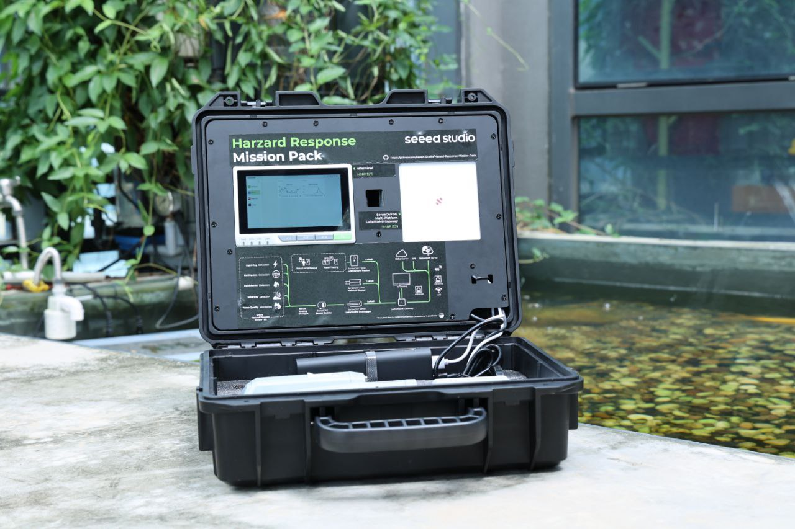

# Hazard-Response-Mission-Pack

Equipping You Today for a Safer Tomorrow

#### Seeed is giving away 5 Kits for free! apply to be selected before the end of this first batch!

### Description:

Hazard Response Mission Pack is a comprehensive solution designed for optimized disaster preparedness[1], management, and response. This pack includes robust devices for data transmission, data processing,  user interface, precise tracking, intelligent visual analysis, and custom sensor development for environmental monitoring. These devices work together to provide a robust yet flexible system for real-time data collection, analysis, and response, enabling efficient management and mitigation of hazard situations.

[1] WFP defines emergency preparedness as “Actions, arrangements, and procedures in anticipation of an emergency to ensure that the response when needed, be rapid, appropriate and effective.” (Source: [WFP’s Programme Guidance Manual, page 10](https://documents.wfp.org/stellent/groups/public/documents/resources/wfp251892.pdf))

### Architecture:

### Part list

| **Name**                          | **Cost** | **Description**                                                                                                      |
|-----------------------------------|----------|----------------------------------------------------------------------------------------------------------------------|
| [reTerminal](https://www.seeedstudio.com/ReTerminal-with-CM4-p-4904.htm)                        | $215     | A Raspberry Pi CM4-powered HMI that processes data locally                                                           |
| [SenseCAP M2 LoRaWAN Gateway](https://www.seeedstudio.com/SenseCAP-Multi-Platform-LoRaWAN-Indoor-Gateway-SX1302-EU868-p-5471.html)       | $139     | A device that transmits sensor data with long-range connectivity                                                     |
| [SenseCAP T1000 LoRaWAN Tracker](https://www.seeedstudio.com/sensecap-t1000-tracker)    | $29.9    | A card size tracker for seamless indoor & outdoor positioning                                                        |
| [SenseCAP A1101 Vision AI Sensor](https://www.seeedstudio.com/SenseCAP-A1101-LoRaWAN-Vision-AI-Sensor-p-5367.html)   | $79      | An intelligent sensor that gets insights from the vision                                                             |
| [SenseCAP S2100 LoRaWAN DTU](https://www.seeedstudio.com/SenseCAP-S2100-LoRaWAN-Data-Logger-p-5361.html)        | $69      | A device designed to facilitate reliable and efficient data communication over LoRaWAN                               |
| [SenseCAP Sensor Builder](https://www.seeedstudio.com/SenseCAP-XIAO-LoRaWAN-Controller-p-5474.html)           | $19.9    | A device to build a custom industrial-grade LoRaWAN sensor                                                           |
| [Grove Natural Disaster Sensor Kit](https://www.seeedstudio.com/natural-disaster-sensor-solution-kit.html) | $65.6    | A collection of 5 Grove modules: Lightning sensor, Vibration Sensor, PM2.5 Dust Sensor, Flame Sensor, and ORP Sensor |

### Call to Action

#### Confirmation throught Replication 

Scientific approach obliges us to confirm a reading with another sensor in order to lower down false positives. This would allow us (for example) to seacrh for wildfires by its [occurance through vision](https://wiki.seeedstudio.com/Train-Deploy-AI-Model-A1101/) and the wildfire sensor or the PM sensros in the pack.

Do you have question about the Kit or ideas on how to implement a Disaster Prevention System?   
Do you know somebody who would?  
We love the problems, and we love looking for solutions!  

#### Seeed is giving away 5 Kits for free! apply to be selected before the end of this first batch!

### FAQ

Since we are receiving some questions by some users, we chose to share some of the answers with you

**Q1:**  Are the neighbourhoods of the cities a safe environment for these kits to operate, without being vandalized? From our point of view, we believe that no it isn’t.  

**A1:** This sensors are meant to be installed in inaccessible places (i.e. on top of a tree or light pole). The vandalization is as possible as to any other urban furniture

**Q2:** For how long do we have to operate this equipment, and do we have to return it in good condition? 

**A2:** the equipment is gifted. We want to hear on how you use it / what you think about it, in order to create a case study.  

**Q3:** Reviewing the technological aspects, this system is designed in such a way, that in order for an event to be captured as “a disaster” it has to be confirmed by the two sensing devices, e.g. the SenseCAP Vision AI sensor and the Disaster Sensor kit or the LoRaWAN Tracker. 

**A3:** The sensors work independently, and the “double witness” is already a way to analyze data (also: depending on the problem you want to find, one of the two sensors may be more important than the other. This kind of choice is yours. In some scenarios, you may want sensor1 to be triggered a certain amount of times in an hour in order the reading to be “interesting” and so on..

**Q4:** Also, the equipment must be installed close to a spot with electrical power in order for the system to be constantly operated. 

**A4:** [SenseCAP 210X sensors have a long battery life](https://sensecap-docs.seeed.cc/pdf/SenseCAP%20LoRaWAN%20Sensor%20User%20Manual-V1.1.pdf) [1], no need for external power in common scenarios (this may depend on the sensor you are willing to hook up to the Datalogger Node, so this may vary.
The SenseCAP M2 Gateway needs to be powered with an external supply and get access to WiFi or an Internet connection so it can transfer the data to the cloud.

> [1] The Sensor Node is powered by a high-capacity battery that lasts up to 3 years (if uploading data once every hour)

**Q5:** In what TRL is this kit? It has to be defined if it is at a product level and simply requires an installation with some minor configuration, or at a prototype phase and needs a development effort. 

**A5:** These sensors are IP66 and ready to be deployed in the wild. The TRL of the form refers to its application: the problem you want to monitor/solve, the availability and the community you want to install in, the system you will use to create the notification system/record data and so on. 

**Q6:** We would like also to know the level of support that is going to be given during the first deployment, or if straightforward guidelines are available (e.g. manual, etc.) 

**A6:** We have [manuals / online documentation](https://sensecap-docs.seeed.cc/) and a discord channel for help. We can provide this information just online and remote though. We expect you to pose questions and test the solution, adding your effort and knowledge of the problem. 

**Q7:** Referring in specific to the Vision AI sensor, do we have to train a computer vision model for disaster detection (e.g. thunderstorm)? By default, the only available models are the human body detection and the meter detection. So, are they indeed available? Is it mandatory to perform an additional development for training a disaster detection model? Because this requires a lot of effort. 

**A7:** We have a Lighting Sensor in the kit, which can be applied to detect lightning. However, SenseCAP Vision AI sensor features a not very high-res camera (the detected item should be within 5 meters to ensure accuracy) and it supports inference with an interval of 5 mins, which makes it not a good fit for detecting disasters of thunderstorm. Currently, the device has 3 different default models of human body detention, object counting, and image classification, which are all ready for use. Regarding other models, we expect the end users to train their own models (wildlife ). [Roboflow has some Vision AI compatible training sets](https://universe.roboflow.com/arkitekv2/lightning_segmentation_1) going in that direction, but these models are to be tested and refurbished. You can follow [this wiki article to learn how to make your own dataset](https://wiki.seeedstudio.com/Train-Deploy-AI-Model-A1101/#software-introduction) or [use another one](https://wiki.seeedstudio.com/Train-Deploy-AI-Model-A1101/#use-publicly-available-annotated-dataset). This [link](https://www.google.com/url?q=https://wiki.seeedstudio.com/Train-Deploy-AI-Model-A1101/%23use-publicly-available-annotated-dataset&sa=D&source=docs&ust=1690802653913211&usg=AOvVaw3QJhydQDPRR5uyf8kqW9lD) is also relevant

**Q8:** Finally, the data will be transferred to their cloud (sensecap server). Is there any chance for local data storing, or in the case of using their cloud, is it any additional cost that we should be aware of? 

**A8:** First of all, it is not mandatory to use the SenseCAP Server when using SenseCAP devices. SenseCAP LoRaWAN sensors and gateways are designed to be compatible with various LoRaWAN network servers, including third-party servers and local servers to manage everything locally. 
Currently, SenseCAP PaaS platforms (cloud, web portal, SenseCAP Mate APP) are offering a 90-day and 180-day free trial for our Tracker and Sensors. After the free trial, we offer licensing package as follows:  
● 30 days validity: $0.99/device  
● 90 days validity: $2.97/device  
● 365 days validity: $11.88/device  