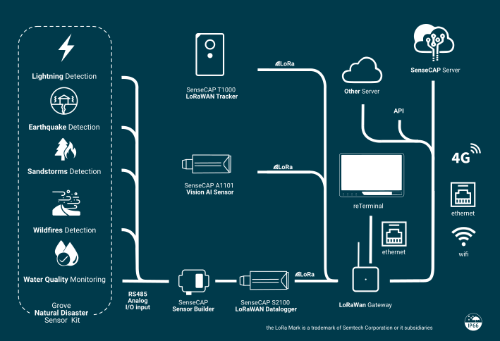

# Hazard-Response-Mission-Pack

Equipping You Today for a Safer Tomorrow

### Description:

Hazard Response Mission Pack is a comprehensive solution designed for optimized disaster preparedness[1], management, and response. This pack includes robust devices for data transmission, data processing,  user interface, precise tracking, intelligent visual analysis, and custom sensor development for environmental monitoring. These devices work together to provide a robust yet flexible system for real-time data collection, analysis, and response, enabling efficient management and mitigation of hazard situations.

[1] WFP defines emergency preparedness as “Actions, arrangements, and procedures in anticipation of an emergency to ensure that the response when needed, be rapid, appropriate and effective.” (Source: [WFP’s Programme Guidance Manual, page 10](https://documents.wfp.org/stellent/groups/public/documents/resources/wfp251892.pdf))

### Architecture:

### Part list

| **Name**                          | **Cost** | **Description**                                                                                                      |
|-----------------------------------|----------|----------------------------------------------------------------------------------------------------------------------|
| [reTerminal](https://www.seeedstudio.com/ReTerminal-with-CM4-p-4904.htm)                        | $215     | A Raspberry Pi CM4-powered HMI that processes data locally                                                           |
| [SenseCAP M2 LoRaWAN Gateway](https://www.seeedstudio.com/SenseCAP-Multi-Platform-LoRaWAN-Indoor-Gateway-SX1302-EU868-p-5471.html)       | $139     | A device that transmits sensor data with long-range connectivity                                                     |
| [SenseCAP T1000 LoRaWAN Tracker](https://www.seeedstudio.com/sensecap-t1000-tracker)    | $29.9    | A card size tracker for seamless indoor & outdoor positioning                                                        |
| [SenseCAP A1101 Vision AI Sensor](https://www.seeedstudio.com/SenseCAP-A1101-LoRaWAN-Vision-AI-Sensor-p-5367.html)   | $79      | An intelligent sensor that gets insights from the vision                                                             |
| [SenseCAP S2100 LoRaWAN DTU](https://www.seeedstudio.com/SenseCAP-S2100-LoRaWAN-Data-Logger-p-5361.html)        | $69      | A device designed to facilitate reliable and efficient data communication over LoRaWAN                               |
| [SenseCAP Sensor Builder](https://www.seeedstudio.com/SenseCAP-XIAO-LoRaWAN-Controller-p-5474.html)           | $19.9    | A device to build a custom industrial-grade LoRaWAN sensor                                                           |
| [Grove Natural Disaster Sensor Kit](https://www.seeedstudio.com/natural-disaster-sensor-solution-kit.html) | $65.6    | A collection of 5 Grove modules: Lightning sensor, Vibration Sensor, PM2.5 Dust Sensor, Flame Sensor, and ORP Sensor |

### Call to Action

Do you have question about the Kit or ideas on how to implement a Disaster Prevention System? [Apply now](https://github.com/Seeed-Studio/Hazard-Response-Mission-Pack/issues/new?assignees=vongomben&labels=Application&projects=&template=hazard.yml&title=%5BApplication%5D+%3A+) 
