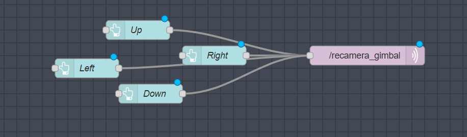
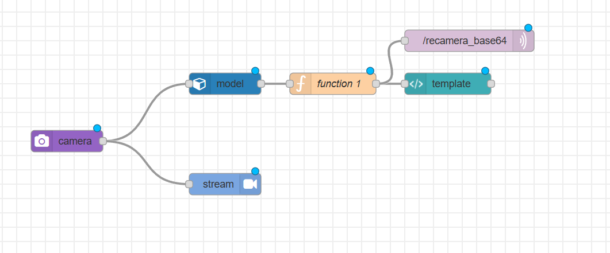
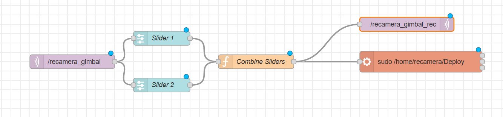
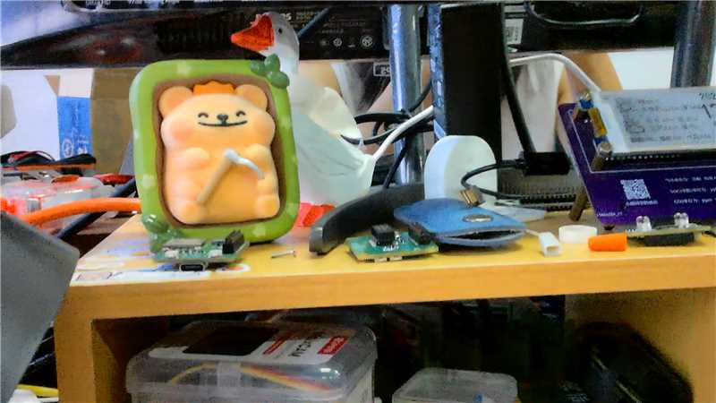

# reCamera_Gimbal

We provide sample node to debug the gimbal motor's operation and status output.  We offer node-code entry points to drive the gimbal motor using RS485 or CAN, enabling precise control and functionality.


> ## This node runs on R1000 to remotely control recamera_gimbal

> ## This node runs on the recamera to load the AI model

The model information is obtained by connecting to the network on mission pack and subscribe to mqtt topic `/recamera_base64`, and the model data package is in json package format.



> ## This node gets the information to control gimbal and passes it to the system driver script



Base64 images can be loaded via the template of the nodered-dashboard module.

```bash

```

```bash
rtsp://192.168.100.10/live #Subscribe to 2K original recamera videos
```


You can check out the video:
https://www.youtube.com/embed/0GJH76yzfQk


<video src='https://www.youtube.com/embed/0GJH76yzfQk'></video>