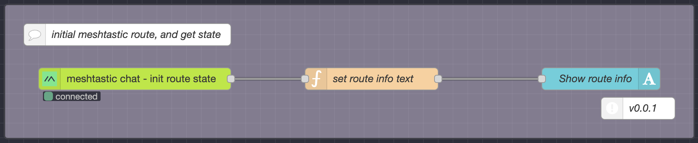

# Communication and Information Sharing

## Initial Meshtastic Route

- Description:
When you want to use meshtastic, you must include this necessary initialization flow in your project.

- Flow snapshot:

  

- [flow.json](./flows/initial-meshtastic-route.json)

## Meshtastic Chat Box

- Flow snapshot:

  

- [flow.json](./flows/meshtastic-chat-box.json)

## Meshtastic Chat to IoT

- Flow snapshot:

  

- [flow.json](./flows/meshtastic-chat-to-iot.json)
