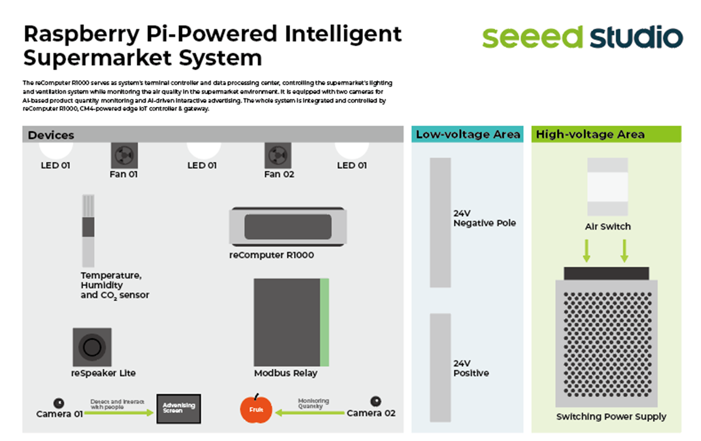
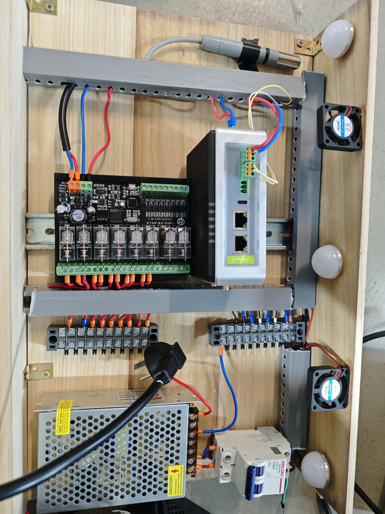
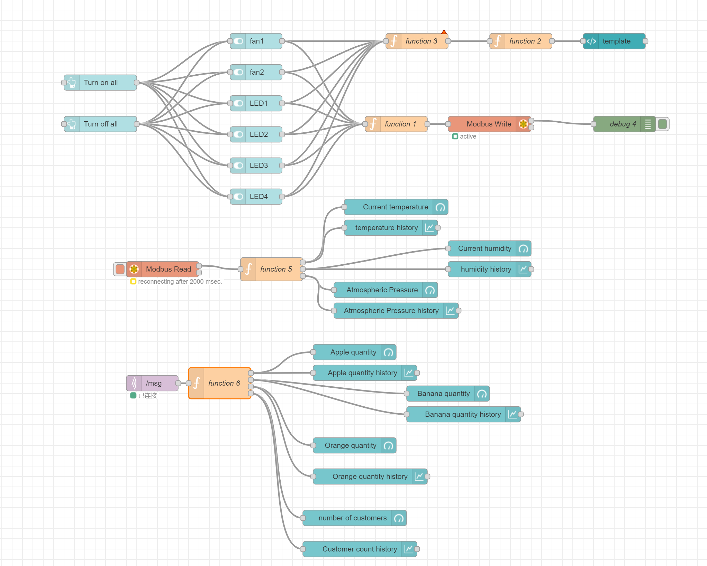
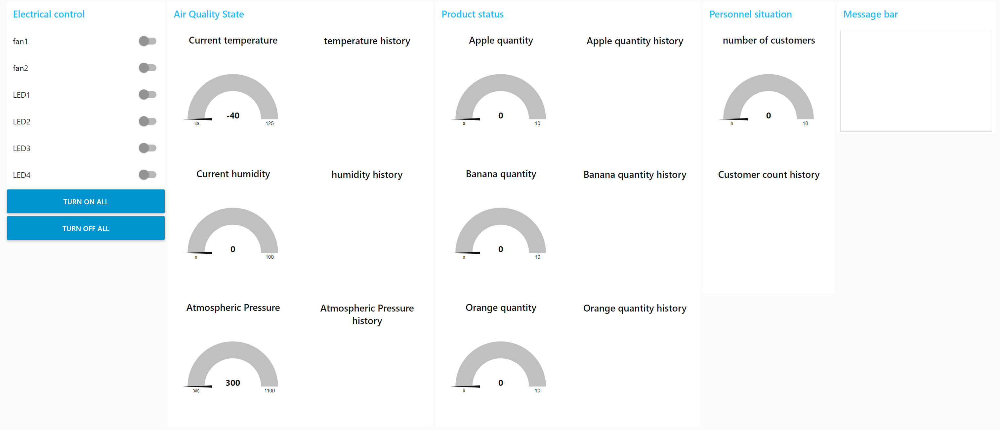

This is the introduction diagram of the project:

This is the hardware of the project, mainly including reComputer R1000, modbus relay, LED lights, fans, air sensors, air switches, switching power supplies, etc.

This is the flow of the entire project. It mainly controls the modbus relay to control the switch of LED and fan, reads the air sensor and draws it on the dashboard.And get the number of visually recognized apples, bananas, oranges, and people.

This is the project dashboard:

